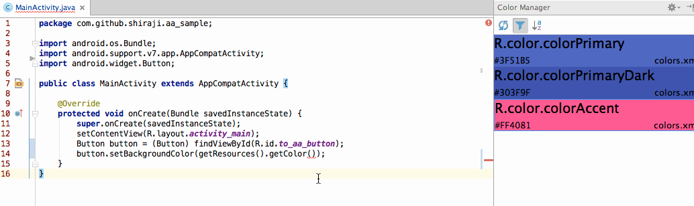
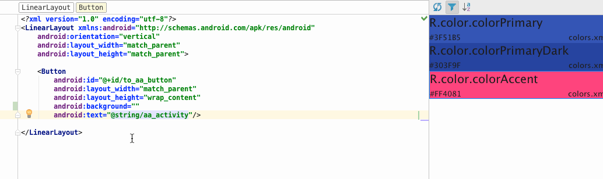
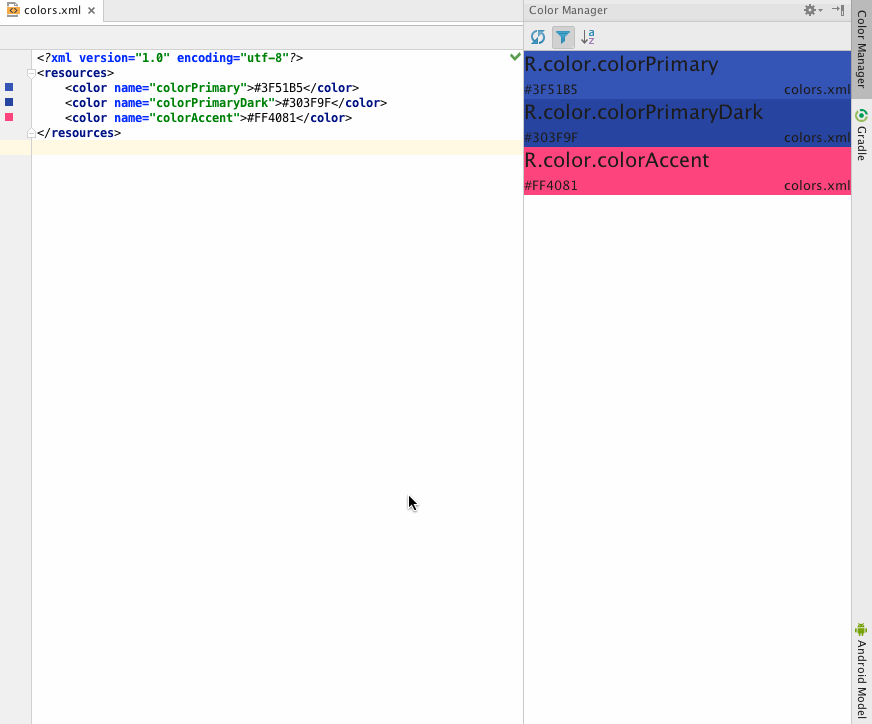
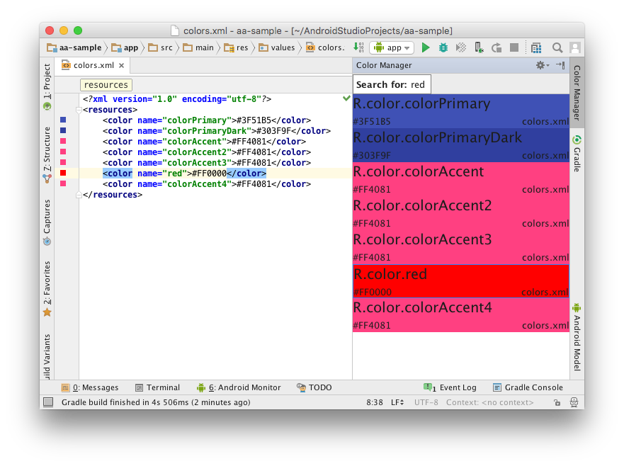
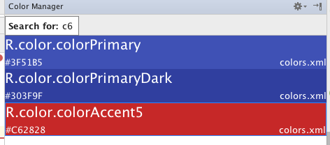
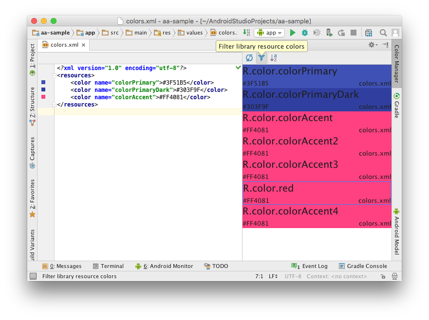
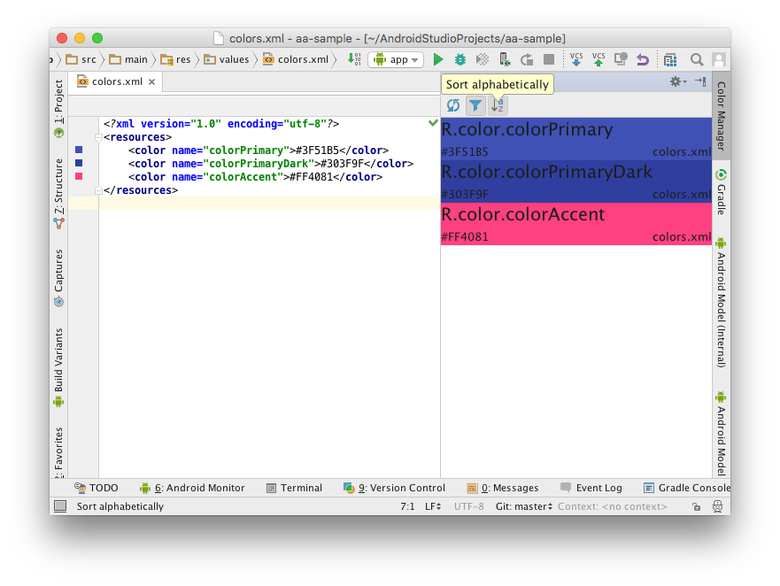
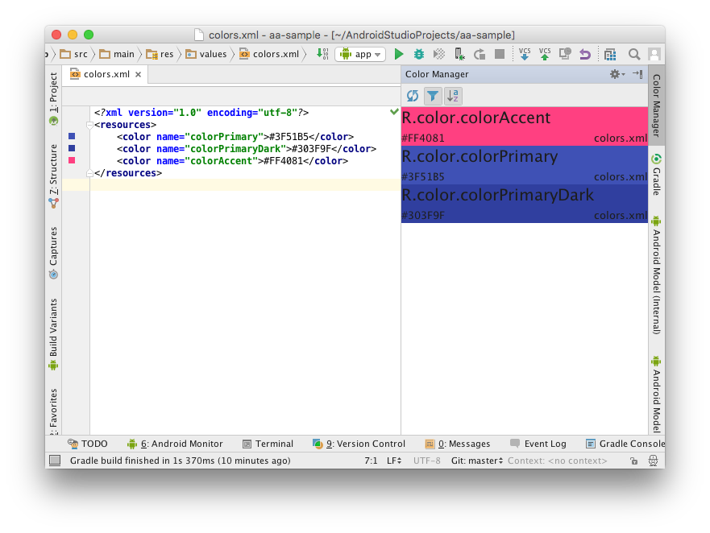

# Android Color Manager

The Intellij plugin that manages Android colors. It makes easy to browse colors.

# How to use

Open "Color Manager" tool window. You will see all colors listed


## Drag and Drop

From v1.1.0, this plugin support drag and drop feature.

* Select a file where you want to drop
* Drag the color panel
* Drop where you want to copy the color name/tag

If the selected file is not xml file, then the drop text format is `R.color.color_name`



If the selected file is xml, then the drop text format is `@color/color_name`



At this moment, there is no way to detect drop target file's type. So, if you select a xml file and drop text to a Java file, this plugin pastes `@color/color_name` not `R.color.color_name`

## Copy

Right click a color listed on the tool window


Click "Copy R.color.whatever_color_name" or "Copy @color/whatever_color_name"

You can also copy color name ("R.color.whatever_color_name" style) by cmd+c (or ctrl+c) after selecting the color panel

## Move to the color definition

Same as Copy. Right click and click "Go to R.color.whatever_color_name"

Or just double click an item

## Edit the color code

Click "Edit R.color.whatever_color_name" and choose new color



## Delete a color

Same as Copy and move. Right click and click "Delete R.color.whatever_color_name"

It will show confirmation dialog before deleting the color tag.

## Search

Just start typing after focusing tool window



The plugin let it finds them by typing a color name and a color code.



## Show all colors

As default, this plugin filter library's color because there are a lot.



You can un-filter those by clicking "Filter" icon (It takes a few second to show all colors)


## Sort by color name

You can sort by color name by clicking sort icon





# How to install?

Use the IDE's plugin manager to install the latest version of the plugin.

# LICENSE

```
Copyright 2016 Yoshinori Isogai

Licensed under the Apache License, Version 2.0 (the "License");
you may not use this file except in compliance with the License.
You may obtain a copy of the License at

   http://www.apache.org/licenses/LICENSE-2.0

Unless required by applicable law or agreed to in writing, software
distributed under the License is distributed on an "AS IS" BASIS,
WITHOUT WARRANTIES OR CONDITIONS OF ANY KIND, either express or implied.
See the License for the specific language governing permissions and
limitations under the License.
```
