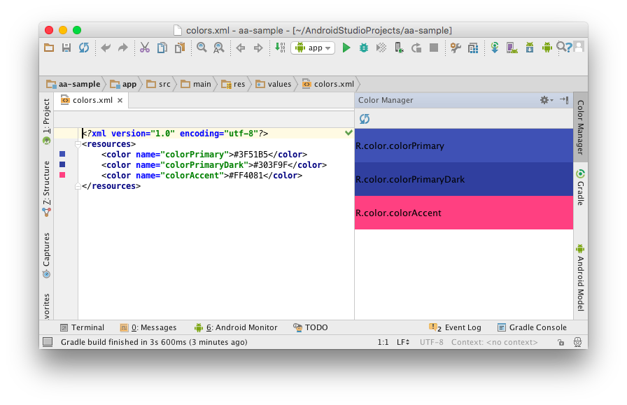
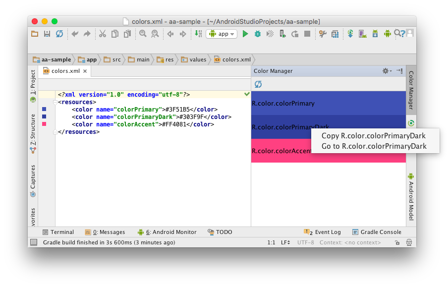

# Android Color Manager

The Intellij plugin that manages Android colors. It makes easy to browse colors.

# How to use

Open "Color Manager" tool window. You will see all colors listed



# Other functions

Right click a color listed on the tool window



Now you can copy color name and move to the color declaration 

# How to install?

Use the IDE's plugin manager to install the latest version of the plugin.

```
Copyright 2016 Yoshinori Isogai

Licensed under the Apache License, Version 2.0 (the "License");
you may not use this file except in compliance with the License.
You may obtain a copy of the License at

   http://www.apache.org/licenses/LICENSE-2.0

Unless required by applicable law or agreed to in writing, software
distributed under the License is distributed on an "AS IS" BASIS,
WITHOUT WARRANTIES OR CONDITIONS OF ANY KIND, either express or implied.
See the License for the specific language governing permissions and
limitations under the License.
```
